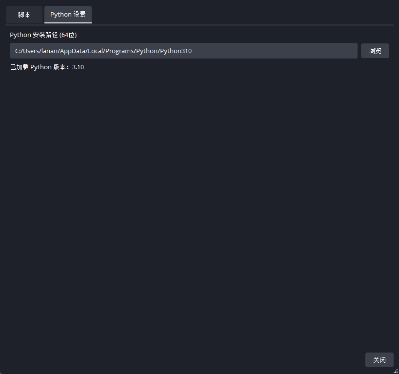
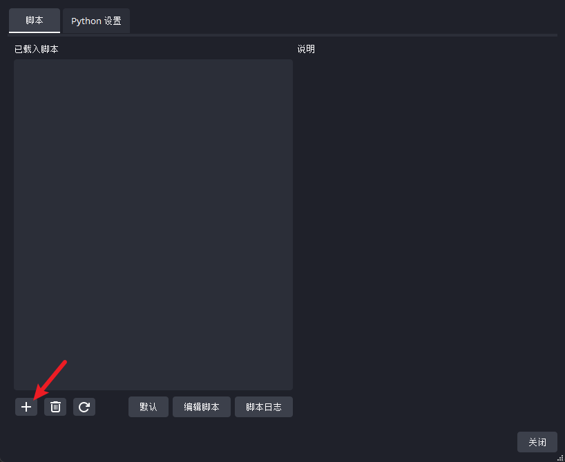
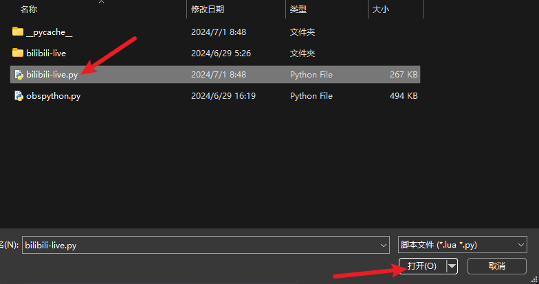

# Windows10 或 Windows11
## 配置插件
- 打开OBS
- 在菜单栏的【工具】中，选择`脚本`
- 在脚本窗口中的`python设置`中配置python安装路径
- 使用以下代码获得python安装路径
```bash
python PYTHONPATH
```
- 例如
```
C:/Users/lanan/AppData/Local/Programs/Python/Python310
```

- 在脚本窗口中的`脚本`中添加脚本`bilibili-live.py`


## 