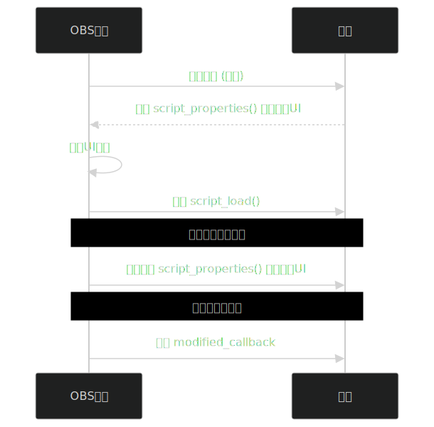

# `obs_properties_set_modified_callback`
```python
class Callable:
    pass
class obspython:
    obs_properties_t = None
    obs_property_t = None
    obs_data_t = None
    pass
def obs_properties_set_modified_callback(props: obspython.obs_properties_t, callback: Callable[[obspython.obs_properties_t, obspython.obs_property_t, obspython.obs_data_t], bool]) -> None:
    """
    为属性集设置值修改回调函数，用于创建动态响应的UI界面。
    
    当用户修改属性集中的任何控件值时，将触发指定的回调函数，允许脚本根据当前控件状态
    动态更新UI、验证输入或执行其他相关操作。
    
    Args:
        props: 属性集对象，由 obs_properties_create() 创建
        callback: 修改事件回调函数，格式为：
                  def callback(props: obs_properties_t, 
                              prop: obs_property_t, 
                              settings: obs_data_t) -> bool:
    
    Callback 参数说明:
        props: 整个属性集对象，可用于访问所有控件
        prop: 触发事件的特定属性对象
        settings: 包含所有当前设置值的对象
    
    Callback 返回值:
        True: 需要刷新UI（重建属性窗口）
        False: 不需要刷新UI
    
    典型用途:
        1. 动态显示/隐藏相关控件
        2. 输入值验证和即时反馈
        3. 自动计算派生值（如根据分辨率推荐码率）
        4. 控件间智能联动（如选择视频源时自动填充其分辨率）
        5. 更新状态提示信息
    
    生命周期:
        - 仅在用户实际修改控件值时触发
        - 初始加载和脚本设置窗口首次打开时不会触发
        - 每次控件值变化都会触发（包括通过代码修改值）
    
    示例:
        def on_property_modified(props, prop, settings):
            prop_name = obs.obs_property_name(prop)
            if prop_name == "enable_advanced":
                # 显示/隐藏高级选项
                advanced_visible = obs.obs_data_get_bool(settings, "enable_advanced")
                advanced_prop = obs.obs_properties_get(props, "advanced_option")
                obs.obs_property_set_visible(advanced_prop, advanced_visible)
                return True  # 需要刷新UI
            return False
        
        props = obs.obs_properties_create()
        obs.obs_properties_set_modified_callback(props, on_property_modified)
    
    注意事项:
        1. 回调函数应保持高效，避免耗时操作
        2. 频繁返回True可能导致UI闪烁（过度刷新）
        3. 复杂操作应使用后台线程处理
        4. 使用obs_property_name(prop)获取触发事件的控件ID
        5. 使用obs_data_get_*函数从settings获取值
    
    关联函数:
        - obs_properties_create(): 创建属性集
        - obs_property_set_visible(): 动态控制控件可见性
        - obs_property_set_enabled(): 动态启用/禁用控件
        - obs_property_set_description(): 更新控件描述文本
    """
    pass
```
### 使用obs_data_set_string可以避免调用`obs_property_set_modified_callback`
```graph LR
    A[用户操作UI] --> B[值变化事件]
    B --> C[触发 modified_callback]
    D[代码设置值] --> E[值变化]
    E --> F[不触发回调]
```

# `obs_property_modified`函数不能随便搭配`obs_property_set_modified_callback`
```python
def obs_property_modified(prop: 'obs_property_t *', settings: 'obs_data_t *') -> bool:
    """
    obs内置函数
    控件属性修改回调函数
    Args:
        prop: 触发事件的属性对象
        settings: 当前所有设置值的集合
    Returns:
        bool: True=需要刷新UI, False=不需要刷新
    """
```
## 使用
```graph TD
A[用户修改控件值] --> B[OBS检测变化]
B --> C[调用obs_property_modified]
C --> D[执行自定义逻辑]
D --> E{需要刷新UI?}
E -->|是| F[重建UI]
E -->|否| G[保持当前UI]
```

### 获取`obs_property_modified`回调之前会立即触发对应控件的`obs_property_set_modified_callback`，但是其本身函数不会改变所对应控件属性的变化


# obs载入脚本至少会调用两次`script_properties`
```python
import obspython as obs
def script_properties():
    props = obs.obs_properties_create()
    return props
```
## 执行流程分析
```sequenceDiagram
participant OBS as OBS核心
participant Script as 脚本

OBS->>Script: 脚本加载 (首次)
Script-->>OBS: 调用 script_properties() 创建初始UI
OBS->>OBS: 存储UI定义

OBS->>Script: 调用 script_load()

Note over OBS,Script: 用户打开设置窗口
OBS->>Script: 再次调用 script_properties() 构建实际UI

Note over OBS,Script: 用户修改控件值
OBS->>Script: 触发 modified_callback
```

### 脚本加载 (首次)时会触发每个控件的`obs_property_set_modified_callback`